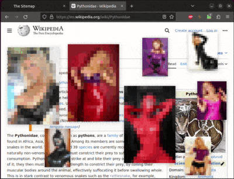
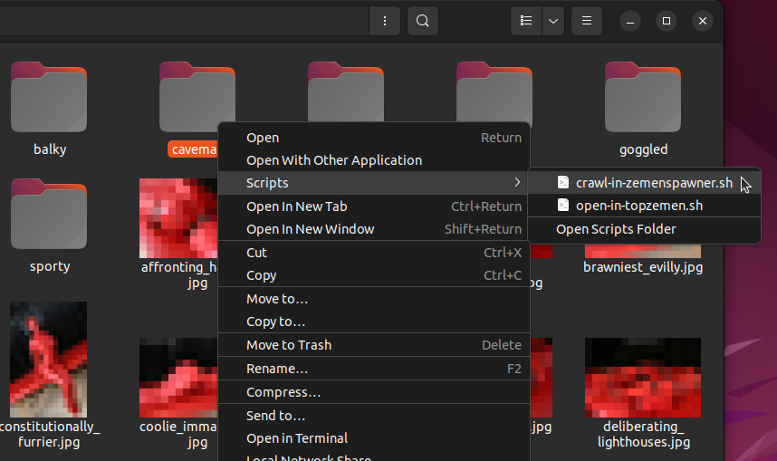

# TopZemen - Floating Pictures on your Screen

With TopZemen you can open your favorite images and have them floating on top of every other window you work with.

Work with any window underneath your images floating in top. Open new images easily:

TopZemen also works on Windows:

You can change the size of the floating images with simple mouse clicks:

> :eggplant: :sweat_drops: *Note: All sample images on this page are censored*

With the included app *ZemenSpawner* you can let it crawl a directory and automatically have random images rain down on your screen. E.g. as a strip on the right:

Of course, you can easily grab any of the images for further inspection.

Also you can set the transparency of the images:

Change the size, rearrange the images:

Play with transparency so you can still enjoy... wikipedia!

Or let the images cover the whole screen in a Matrix-style "rain":

# Benefits
* All image commands are entered via mouse click sequences (hands free!)
* spelled "Top Sea-Men" (very maritim!)

# Requirements

* Microsoft Windows or Ubuntu Linux (was written on Ubuntu, should work on all big distros). Works probably on MacOS when tweaked
* Python 3 with tkinter
* PIP Python Package Manager

# Installation

## Ubuntu Linux Installation

### 1. Clone this repository

Clone this repository into a writeable directory.

### 2. Install python tkinter and pillow

`sudo apt-get install python3-tk python3-pil.imagetk`

### 3. Install TopZemen via pip

In the repo's root run

`chmod +x install_ubuntu.sh`

`./install_ubuntu.sh`

It installs TopZemen via Python's PIP and creates Nautilus shortcuts.

> :cherries: *Do not run the install_ubuntu.sh as root (sudo), as it would create files for root user and not for you*

## Windows Installation

### 1. Clone or download this repo

Yes, clone or download this repo now!

### 2. Install Python

Download and install Python 3

[https://www.python.org/downloads/windows/](https://www.python.org/downloads/windows/)

### 3. Install TopZemen via pip

Start (doubleclick) `install_windows.bat`

It installs TopZemen via Python's PIP and creates the shortcuts in Explorer's "Send to" menu.

# Getting started

## Open an image

Right click an image in file manager and select open-in-topzemen.sh in the Scripts menu.

Under Windows go into the *Send to* menu and select open-in-topzemen:

The image will now be present over all other windows in the top left corner on your screen and it will stay on top.

You can drag it around with the left mouse button.

## Close an image

You interact with a TopZemen image via mouse click sequences, since you do not have control buttons nor an icon in the taskbar.

To close the image just click the *sequence*:

* right mouse button
* right mouse button
* left mouse button

on the image with a double-click like speed (=fast).

## Change the size

Increase the size of a TopZemen by clicking the *sequence*

* right mouse button
* left mouse button

on it.

Decrease the size by clicking left then right on it.

## Change the transparency

Press the middle mouse button (the wheel) to toggle through the transparency modes.

## Automatically open images

With the ZemenSpawner you can create your Matrix Rain like Slideshow.

Right click on a *folder* that contains the images you want to appear. This folder can also contain subdirectories and can be as big as you like.

From the Scripts menu select crawl-in-zemenspawner.sh:

On Windows you find the ZemenCrawler under the *Send to* menu:

The ZemenSpawner Window opens up and an image should appear raining down on the right of your screen (when you use 1 Full HD Screen -- it depends on your screen size).

With the values *horizontal from .. to .. pixel* you can now change the pixel positions between which the images should appear. Play with these values to suit your screen size. Remember to let the first value be smaller than the second one.

## Close all images

Press *close all & exit* in the ZemenSpawner window to close all TopZemen images you have floating on your screen.

# TopZemen Commands

## CLI Commands

You can run TopZemen from the command line or a script and open any image you like:

`topzemen /path/to/image.jpg`

Same with the ZemenSpawner. You call it with a directory path:

`zemenspawner /path/to/directory`

## Mouse Click Commands

These clicks work on every TopZemen floating image:

| Clicks | Command |
|--------|---------|
| `R L`| zoom in  |
| `L R`| zoom out  |
| `R R`| open image in external viewer  |
| `R R L`| close image / close TopZemen |
| `M`| change transparency  |

## ZemenSpawner settings and commands

### Horizontal from .. to .. pixel

Sets the start and end horizontal pixel where new TopZemens will rain down. A typical Full HD Screen has 1920 pixels.

Here ZemenSpawner is set to let the images rain down on the right side (Two manual positioned images are on the left):

Here the rain is set to 0 to 1920 to cover the whole screen:

### stop spawn / resume spawn

This will pause the spawning and resume it. Note that there is no feedback given at the moment except images stop or start raining down.

### spawn every .. to .. seconds

The time ZemenSpawner waits between new images. With this setting you control the density of the rain. The shorter the wait time and the shorter the rain distance horizontally is, the denser the images will rain.

If you find your system starts to lag, try spawning less frequent. This happens because every TopZemen is a separate own python process (a separate program running).

### hide all / show all

This will hide or show all TopZemens currently on the screen. New TopZemens are not affected by that.

If you want to pause the TopZemen rain, press *stop spawn* and then *hide all*.

### Close and exit

The ZemenSpawner works independently from all TopZemens. You can close it separatly and reopen it, e.g. just to close all open TopZemens.

| button | Raining TopZemens | Manual TopZemens | ZemenSpawner|
|--|--|--|--|
| close all autoscroller| closed | not affected | not affected |
| close all manual positioned | not affected | closed | not affected|
|close all | closed | closed | not affected |
| close all & exit | closed | closed | closed |
| exit |  not affected | not affected | closed|

# Known bugs and limitations

* If an image is loaded floating over Ubuntu's taskbar, it cannot be touched in the area of the taskbar
* ZemenSpawner has a rudimentary crawler. It just skips up to 1000 images until the next one. This will lead to always the similar set of images when you start it on the same directory (this will be improved with a better crawler in an upcoming version!)
* Commands issued via ZemenSpawner sometimes do not reach all TopZemens or one of them crashes.

# Technical Stuff

* Every TopZemen is a separate own python process (a separate program running)
* TopZemens and the ZemenSpawner use port 6000 on localhost for inter process communication.